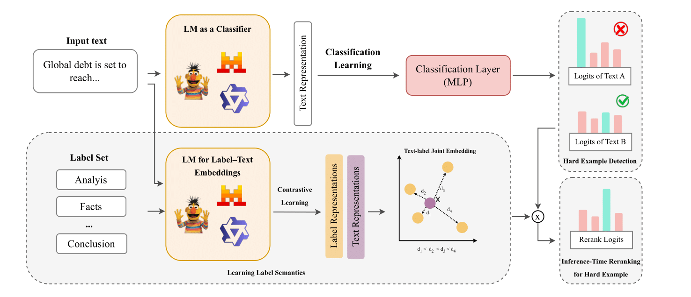

# Semantic Reranking at Inference Time for Hard Examples in Rhetorical Role Labeling

---

Rhetorical Role Labeling (RRL) assigns a functional role to each sentence in a document and is widely used in legal, medical, and scientific domains. While language models (LMs) achieve strong average performance, they remain unreliable on hard examples, where prediction confidence is low. Existing methods handle uncertainty implicitly and treat labels as discrete identifiers, ignoring the semantic information encoded in label names.
We introduce **RiSE**, an inference-time semantic reranking framework that leverages label semantics to refine predictions on hard instances. **RiSE** automatically detects low-confidence predictions and reranks model outputs using contrastively learned label representations, without retraining or modifying the underlying model.
Experiments on eight RRL datasets with seven encoder-based and causal LMs show an average gain of **+9.15 macro-F1** points on hard examples. We further propose manual hardness annotations to study difficulty from both model and human perspectives, enabling deeper error analysis and improved explainability.

